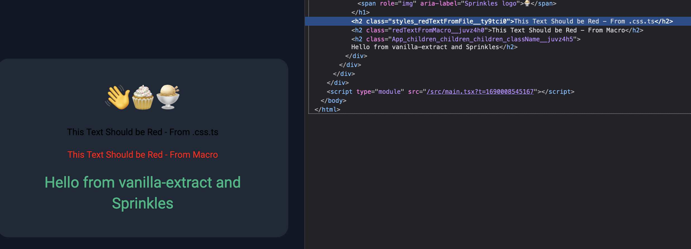

# Macros Playground

## Bug - Styles from .css.ts file not working

The app has two pieces of text added.

"This Text Should be Red"

Both have classes that color the text red.

- The first's class is generated in a .css.ts file, and doesn't show as red.
- The second's class is generated in a macro, and shows as red.



Note that even though the styles don't work, I don't see the typical error that you'd expect when using non-macro functions outside a .css.ts file.

**I Don't Get:**

```
Styles were unable to be assigned to a file. This is generally caused by one of the following:

- You may have created styles outside of a '.css.ts' context
- You may have incorrect configuration. See https://vanilla-extract.style/documentation/getting-started
```
